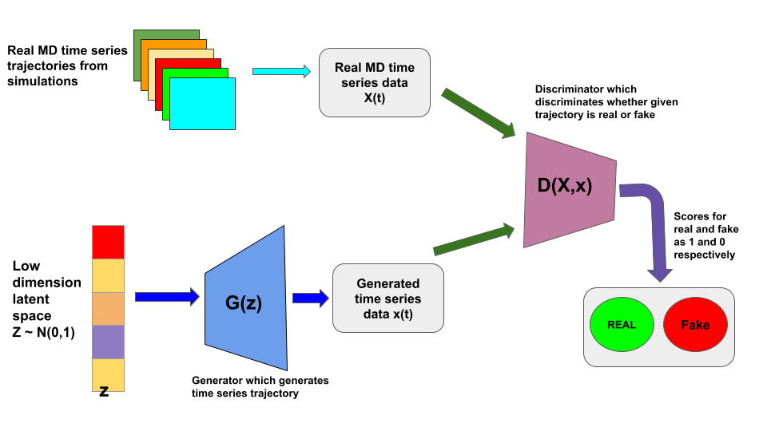
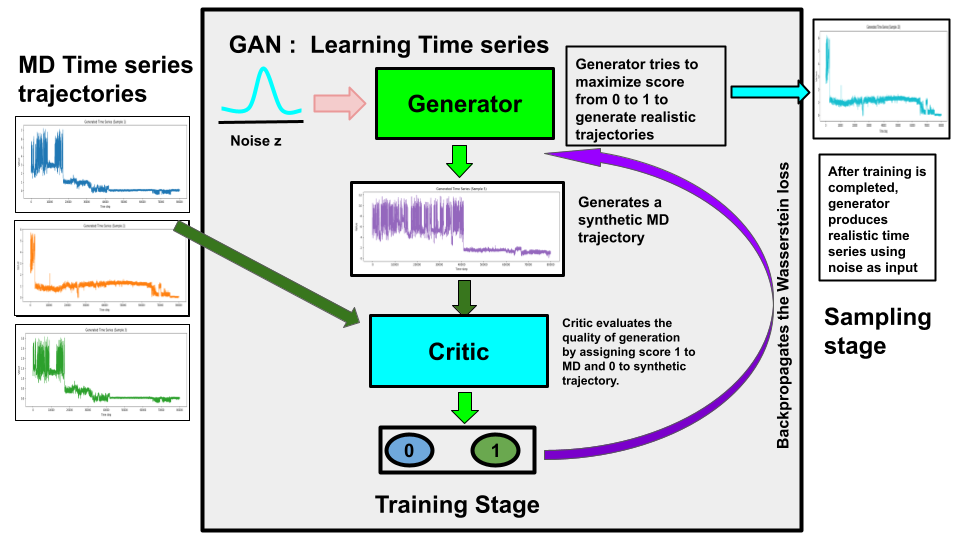

# Generative Adversarial Networks for Molecular Time series trajectory generation via implicit distribution learning

Welcome to the repository of the research project titled "Fast Generation of Temporal Molecular Dynamics Trajectories using
GANs."

# Abstract

Molecular dynamics (MD) simulations yield atomic-level insights into molecular motion but
struggle to reach the long timescales needed for rare events due to prohibitive computational costs.
Generative machine-learning models (e.g., diffusion models and normalizing flows) offer a promising
route to accelerate sampling, yet they generate independent equilibrium snapshots without tem-
poral correlation or kinetic information. Autoregressive sequence models can learn time evolution
by producing one frame at a time, but this stepwise generation often accumulates errors and drifts
from true dynamics. Here, we propose a complementary approach inspired by advances in image
and video generation: we treat finite MD trajectory segments as high-dimensional objects and
learn their joint distribution using Generative Adversarial Networks (GANs). Using a Wasserstein
GAN with gradient penalty, we directly generate entire time-series trajectories in one shot, that
remain physically coherent over time without explicitly integrating the equations of motion. We
demonstrate the generality of this method on molecular systems of increasing complexity: a 2D
triple-well potential energy landscape, a protein–ligand binding process (cytochrome P450), the
dynamics of an intrinsically disordered protein (α-synuclein) in a latent coordinate space, and even
the conditional generation of folding trajectories for the Trp-cage mini-protein. In all cases, the
GAN-generated trajectories closely reproduce the true free-energy landscapes and kinetic signa-
tures of the systems, while enabling efficient sampling of rare events that would ordinarily require
months of conventional MD simulation

# Architecture

# Training and Sampling scheme 

# Code Requirements
Ensure you have the following Python packages installed to run the code:

- numpy  
- pytorch  
- matplotlib  
- scipy  
- scikit-learn  
- tqdm
  
# Package version
- Python 3.12.3
- pytorch (2.2.0)
- numpy (1.26.4)
  

# Training and Sampling 
Training and sampling script for various systems are provided in the respective folders.

- For Model 2d model system
  three_well_GAN.py is the training script which trains and saves the model 
  generate.py is the sampling script from a saved model

# Data 

In data section , we provided the data for toy two dimensional three well potential Brownian Dynamics for user reproducability.

